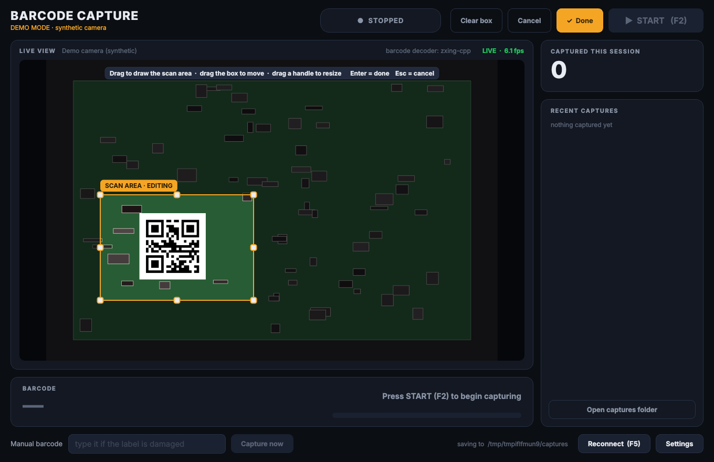
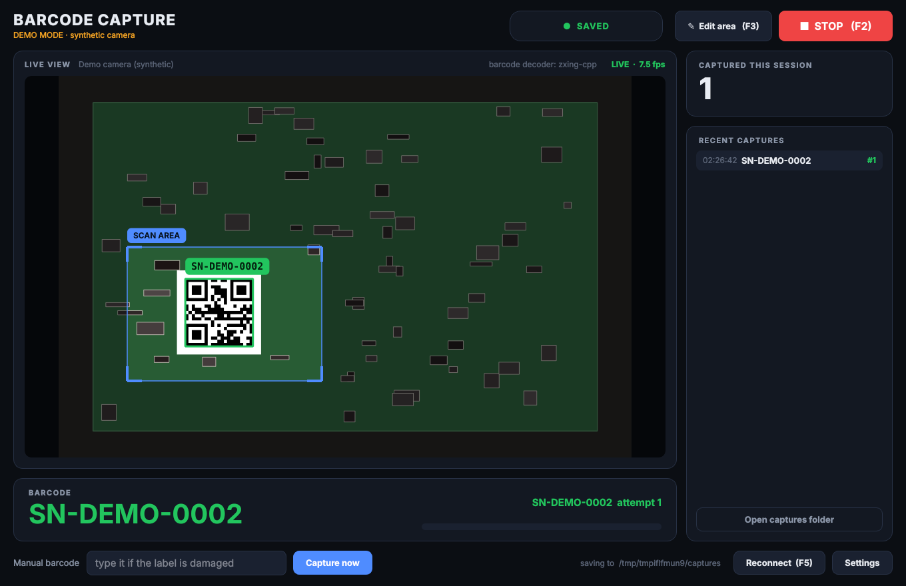
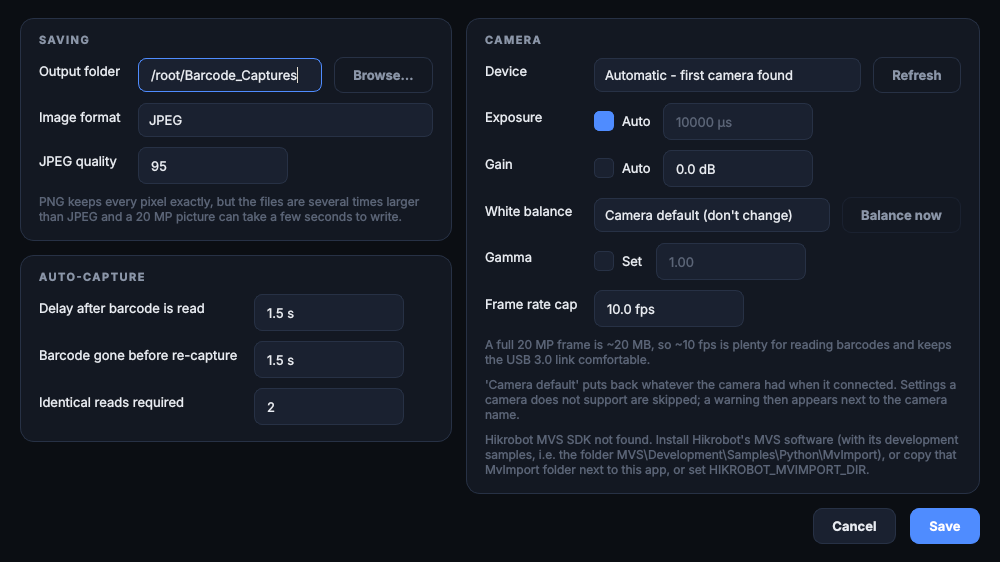

# Barcode Image Capture (Hikrobot MV-CS200-10UC)

Reads a barcode/QR code from the live view of a Hikrobot **MV-CS200-10UC**
(20 MP, 5472 x 3648, USB3 Vision), then saves a full-resolution photo into a
folder named after that barcode. You tell the app *where* the barcode is by
dragging a box on the live picture, and from then on it runs by itself.

> **Ringkas (BM):** `pip install -r requirements.txt` -> pasang MVS Hikrobot ->
> `python list_cameras.py --grab` (semak kamera) -> `python main.py`.
> Tekan **Edit area**, seret kotak di sekeliling barcode, tekan **Done**, kemudian
> **START**. Gambar disimpan dalam `folder-output/<barcode>/<barcode>_attempt_1.jpg`
> (atau `.png` kalau kau pilih PNG dalam Settings).
> Cuba tanpa kamera: `python main.py --demo`.

## What it looks like

Drag a box around the barcode (**Edit area**), press **Done**, and it captures by itself:





<details><summary>Settings</summary>



</details>

## Requirements

- Windows, **64-bit** Python 3.10+
- **Hikrobot MVS** installed (the camera's own software). This app drives the camera
  through MVS's SDK because the camera is USB3 Vision, not a webcam, so OpenCV
  cannot open it. The SDK is Hikrobot's proprietary software and is **not** included
  in this repository.
- The camera on a **USB 3.0 port** (blue connector) with a good USB 3 cable
- A barcode or QR label visible to the camera

## Setup

```
pip install -r requirements.txt
```

Then check the camera before running the app:

```
python list_cameras.py            is MVS found? which cameras are connected?
python list_cameras.py --grab     ...and open the camera, grab one frame, save camera_test.jpg
python list_cameras.py --features ...and list which image settings (white balance, gamma...) this camera supports
```

Each step prints `[OK]` or `[FAIL]` with the reason, so you know exactly what to fix
(SDK not installed, camera not on the USB bus, camera busy in MVS, no frames arriving).

The app finds MVS's Python wrapper (`MvImport`) automatically in
`C:\Program Files (x86)\MVS\Development\Samples\Python\MvImport`. If yours is
elsewhere, set the `HIKROBOT_MVIMPORT_DIR` environment variable to that folder, or
copy the `MvImport` folder next to `main.py` (it is git-ignored on purpose).

**Close MVS itself before starting this app**: only one program can hold the camera.

### Try it without the camera

```
python main.py --demo
```

Demo mode runs the whole workflow against a synthetic camera. Items with barcodes in
*different places* move in and out of view, so you can practise drawing the scan area.

## Using the app

```
python main.py          (or double-click run.bat)
```

| Control | What it does |
|---|---|
| **START / STOP** (F2) | Arms / disarms auto-capture. While stopped nothing is saved and a running countdown is cancelled, but the live view and barcode boxes keep working. The app starts armed. |
| **Edit area** (F3) | Draw or adjust the scan area (below). |
| **Capture now** | Saves a photo under a barcode you type in the *Manual barcode* box (for damaged labels). Disabled while stopped. |
| **Reconnect** (F5) | Re-opens the camera, e.g. after re-plugging the USB cable. |
| **Settings** | Output folder, camera, exposure/gain, timing. |
| **Open captures folder** | Opens the output folder in Explorer. |

### The scan area (the box you drag)

The app only looks for barcodes **inside the box**. That makes reading faster and
more reliable on a 20 MP picture, and it ignores other labels in view.

1. Press **Edit area**. The picture outside the box is dimmed and a hint appears.
2. **Drag on empty space** to draw a new box. **Drag inside the box** to move it.
   **Drag a handle** (the white squares on the corners and edges) to resize it.
3. **Done** (or Enter) keeps it, **Cancel** (or Esc) discards your changes,
   **Clear box** removes it (the whole picture is scanned, which is slower).

The box is saved in `settings.json` as fractions of the picture, so it is still in
the right place after a restart or a resolution change. While you edit, auto-capture
is paused.

### What happens automatically

1. The camera streams continuously; the app reads the barcode inside the scan area.
2. When the same value has been read several times in a row (*Identical reads
   required*, a guard against misreads), a countdown starts (*Delay after barcode is
   read*) so you can finish positioning the item.
3. When the countdown ends, one full-resolution frame is saved:

   ```
   {output folder}/{barcode}/{barcode}_attempt_1.jpg      (.png if you chose PNG)
   {output folder}/{barcode}/log.txt
   ```

4. If the barcode leaves view for longer than *Barcode gone before re-capture*
   **during the countdown**, the capture is cancelled (it will not photograph an empty
   fixture). A brief flicker, such as a hand passing over the label, is tolerated.
5. If the same barcode is scanned again later (after it has left view), nothing is
   overwritten: it is saved as `_attempt_2`, `_attempt_3`, and so on. While the item just
   sits there after being captured it does **not** keep re-triggering.

`log.txt` gets one block per attempt: barcode, time, image size, camera model and
serial, pixel format, the exposure and gain actually in use, the scan area, and whether
the capture was automatic or manual, and the white balance mode and gamma. Characters Windows does not allow in folder names
(`\ / : * ? " < > |`) are replaced with `_` in the folder name; `log.txt` keeps the
original barcode text.

## Settings

| Setting | Meaning |
|---|---|
| Output folder | Where the barcode folders are created |
| Image format | JPEG (default) or PNG (lossless). See *Image quality* below for size and speed |
| JPEG quality | 1-100. Only used for JPEG |
| Device | Which camera, by serial number. "Automatic" uses the first one found |
| Exposure / Gain | Auto, or fixed values. For repeatable pictures under steady lighting, a fixed exposure is better than auto. Changes apply live |
| White balance | *Camera default* leaves it as the camera has it. *Auto* / *Off* are sent to the camera. **Balance now** measures it once from what the camera sees (point it at a white or grey sheet first) |
| Gamma | Tick *Set* to send a gamma value (0.1-4.0) to the camera. Unticked, gamma is left alone |
| Frame rate cap | Default 10 fps. A full frame is ~20 MB, so the USB 3.0 link is already busy near the camera's ~19 fps maximum, and barcodes do not need more |
| Delay after barcode is read | Countdown before the shot |
| Barcode gone before re-capture | How long the barcode must be out of view before it can be captured again, and how long it may vanish mid-countdown before the capture is cancelled |
| Identical reads required | Consecutive identical reads needed before a barcode is accepted |

Everything is stored in `settings.json` next to `main.py` (created on first run, not
tracked by git).

Going back to *Camera default* for white balance or gamma puts back the value the camera
had when the app connected to it (only for settings this app changed). If a camera does
not support a setting, it is skipped and an amber **"N camera settings not applied"**
label appears next to the camera name; hover it for the list. Run
`python list_cameras.py --features` to see what your camera does support.

## Camera notes

- The camera has a **rolling shutter** sensor, so keep the item still while it is being
  photographed; that is what the countdown is for. Fast-moving items would be skewed.
- The app asks the camera for raw **8-bit Bayer** and converts it itself. That is the
  lightest format over USB (20 MB per frame instead of 60 MB for RGB). Only the scan
  area is converted for barcode reading and only the saved frame is converted at full
  size, so the window stays responsive.
- Use manual or fixed focus where you can; autofocus hunting between shots gives
  inconsistent sharpness.

## Image quality

What makes a picture clear is mostly physical: **lens focus and aperture, lighting,
a short exposure, and distance**. Software cannot add detail that was never captured, so
fix those first. What the app itself does to the saved picture:

- It converts the camera's raw Bayer data to colour with OpenCV's **edge-aware**
  method. On my synthetic fine-detail test that cut the average colour error by about
  7% compared with the plain method: a real but small gain, not a dramatic one.
- It does **not** sharpen, denoise or "AI-enhance" the picture, on purpose: those can
  invent detail that is not there, which is the wrong thing for an inspection photo.

**White balance and gamma.** The camera sends raw data, so colours come from the
conversion plus whatever the camera applies itself. I could not confirm from public
documentation whether the MV-CS200-10UC applies white balance to raw Bayer data before
sending it. So the app leaves it alone by default. If colours look off (greenish, pale),
compare with the same scene in MVS, then try *White balance: Auto* or **Balance now**
on a white sheet. Do not correct the same thing in both places.

**PNG vs JPEG.** PNG keeps every pixel exactly; JPEG quality 95 is visually very close
but is lossy. Measured on this sandbox with test pictures (yours will differ):

| | time to write one 20 MP picture | file size |
|---|---|---|
| JPEG, quality 95 | 0.06-0.17 s | 2-22 MB |
| PNG | 1.4-3.2 s | 15-56 MB |

So PNG makes the status stay on SAVING for a couple of seconds after each capture, and
fills the disk several times faster. Use it if you need exact pixels (for example, to
train or measure on the images); otherwise JPEG is the sensible default.

## Barcode formats and size

Decoding uses `zxing-cpp` (QR, DataMatrix, Code128, Code39, Aztec, PDF417, EAN/UPC, ITF
and more). If it is not installed the app falls back to pyzbar, then to OpenCV (QR
codes only); the active decoder is shown above the live view.

A linear (1D) barcode needs roughly **2 pixels per narrow bar** to decode, so it fails
if it is too small in the picture, and *silently*, which looks the same as "no barcode
there". When the app sees a barcode it cannot read, it says so: the status becomes
**BARCODE UNREADABLE** and an amber dashed box marks it. The barcode's own pixel width
is what matters. This camera gives about 2.85x the pixels across a label that a 1080p
camera does, but if it is still too small, move the camera closer or use a longer
lens. A QR code or DataMatrix is far more forgiving than Code128 at small sizes.

## Troubleshooting

**"Hikrobot MVS SDK not found"**: install MVS, make sure the development samples are
included (the folder `...\MVS\Development\Samples\Python\MvImport` must exist), or point
`HIKROBOT_MVIMPORT_DIR` at your copy.

**"could not load the MVS runtime ... MvCameraControl.dll"**: MVS is not installed, or
Python is 32-bit (use 64-bit Python), or MVS was installed after Python started: open a
new terminal.

**"No Hikrobot USB camera found"**: check the cable, use a blue USB 3.0 port, try
another port. Windows Device Manager should list the camera under the USB3 Vision
devices.

**"Could not open the camera (0x80000203)"**: another program has it. Close MVS or
any other camera software, then unplug and re-plug the cable and press F5.

**Camera opens but there is no picture / "stopped responding"**: usually a weak USB
link. Use a short, good USB 3 cable straight into the PC (not through a hub) and lower
the frame rate cap in Settings.

**The barcode is never detected**: draw the scan area right around the label, check
that the green box appears over it, and improve lighting/focus (see *Barcode formats
and size*).

**The picture is very dark or very bright**: switch exposure/gain between Auto and
manual in Settings.

**"N camera settings not applied"**: the camera refused something (often a gamma or
white balance feature it does not have). Hover the label for which one, and run
`python list_cameras.py --grab --features` to see everything this camera supports.

## Tests

```
pip install -r requirements-dev.txt
pytest
```

The suite needs no hardware and no display. The Hikrobot layer is tested against
`tests/fake_mvimport/`, a stand-in that copies the real wrapper's API shape, so the
discovery, setup, grabbing and failure-handling code all run. **It cannot prove the real
SDK and camera behave identically**, so on the machine with the camera, run
`python list_cameras.py --grab --features` once to confirm the real hardware path.
